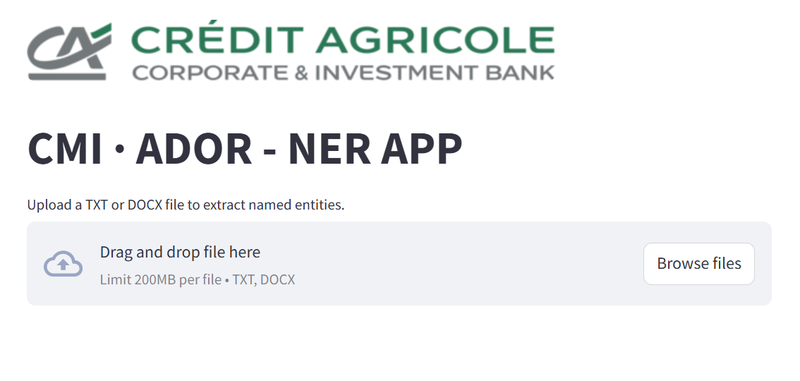
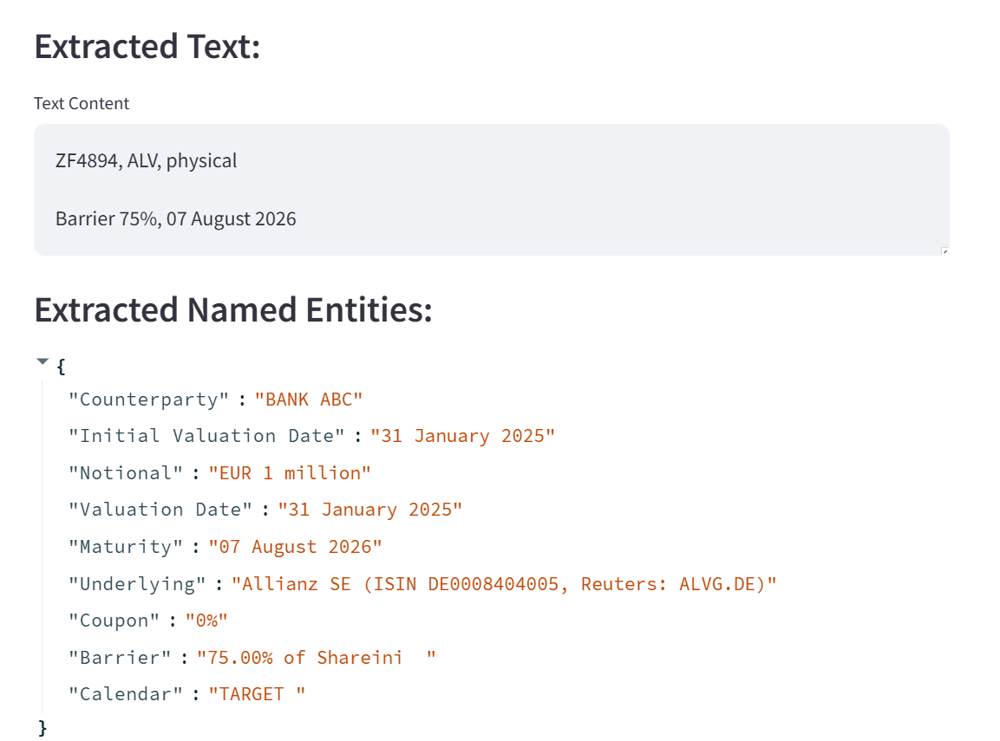
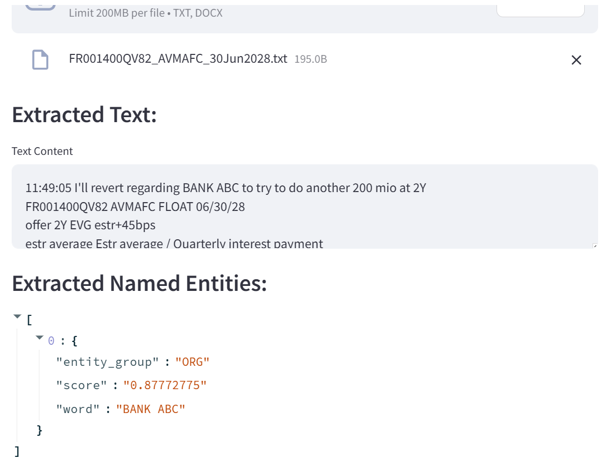

# **AUGMENTED DOCUMENT READER**

## **📌 The Application**
The **AUGMENTED DOCUMENT READER** application features a **Streamlit-based graphical interface**, allowing users to perform **Named Entity Recognition (NER)** on uploaded documents.

Two file formats are supported: **TXT and DOCX**. The user **uploads a file**, and the appropriate **NER algorithm is automatically triggered**. The result is provided in **JSON format**.

The different types of NER implemented are **tested directly in the notebook** `named_entity_recognation.ipynb`:
- **Rule-Based NER** (using predefined rules)
- **Open Source Model-Based NER** (using pre-trained models)
- **LLM/RAG-Based NER** (leveraging a language model and a retrieval-augmented system)

For **LLM/RAG-Based NER**, I implemented a **RAG system** using **Langchain, FAISS, and Mistral (via Ollama)** locally.  
The **RAG (Retrieval-Augmented Generation)** approach is particularly useful for **long and complex documents** because it allows the system to **extract only the most relevant sections** before passing them to the LLM for Named Entity Recognition (NER).  

This method helps to:  
- **Reduce noise** in the input, ensuring the model focuses on key information.  
- **Improve accuracy** by providing the LLM with highly relevant context.  
- **Optimize processing efficiency**, as the model does not need to analyze entire documents at once.  


## **🔹 The NER App:**


## **🔹 Rule-Based Entity Extraction (DOCX File):**


## **🔹 NLP Model-Based Entity Extraction (TXT File):**


---

## **💡 How to Build a NER Model for Financial Data?**
You can **fine-tune** a pre-trained NER model on your own financial data.

### **1️⃣ Data Collection**
- Gather **annotated financial documents**.  
- Label financial entities (**ORG, MONEY, INSTRUMENT, DATE, etc.**) using the **BIO format** for example.  
- Clean and preprocess the data for compatibility.  

### **2️⃣ Fine-Tuning**
- Choose a **pre-trained NER model** (e.g., Hugging Face).  
- Train only the **classification head** while **freezing** the early layers of the model.  

## **🚀 How to Run the APP**
Before running the app, install all required dependencies using:
```bash
pip install -r requirements.txt
```
Download the two models from hugging face and place them in the folder `pretrained-models` in the root directory :
```bash
git clone https://huggingface.co/sentence-transformers/all-MiniLM-L6-v2
```
and 

```bash
git clone https://huggingface.co/dslim/distilbert-NER 
```
The two models are : 
`distilbert-NER` for NER and  `all-MiniLM-L6-v2` for  Embedding used in the RAG pipeline

Move to the root directory of the project and Run:
```bash
streamlit run app.py
```
---